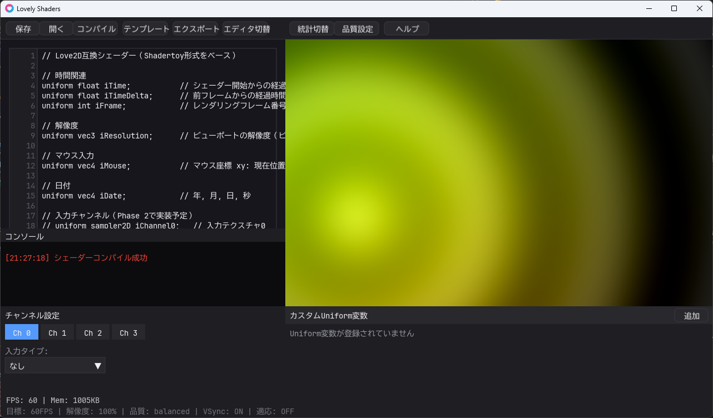

# Lovely Shaders

Love2Dを使用したローカル動作のシェーダー開発環境。Shadertoyの機能をベースに、Love2Dの特性を活かした親しみやすいツール。



## 実行方法

```bash
love .
```

## フォント設定

指定フォント: `asset/font/UDEVGothic35HSJPDOC-Regular.ttf`
- エディタ: 14pt
- UI: 13pt
- フォントファイルが見つからない場合は自動的にデフォルトフォントにフォールバック

## 実装状況

### ✅ Phase 1 MVP（完了）
- 基本的なテキストエディタ
- Shadertoy互換のUniform変数
- シンプルなファイル保存・読み込み
- 基本的なエラー表示
- 手動コンパイルボタン

### ✅ Phase 2（完了）
- 入力チャンネルシステム（画像読み込み）
- プリセット・テンプレート機能
- 画像エクスポート機能
- UI/UX改善

### ✅ Phase 3（完了）
- **カスタムUniform変数** - GUI経由でfloat/vec2/vec3/vec4パラメータ追加・調整
- **パフォーマンス監視** - FPS、フレーム時間、メモリ使用量表示
- **最適化オプション** - 解像度調整、フレームレート制限、品質設定

## キーボードショートカット

- **F1**: ヘルプ表示
- **F5**: シェーダーリロード
- **F11**: フルスクリーン切り替え
- **F12**: 統計詳細表示切り替え
- **Ctrl+S**: 保存
- **Ctrl+O**: 開く
- **Ctrl+E**: エディタ表示切り替え
- **ESC**: 終了

## 主な機能

- **シェーダーエディタ** - リアルタイムコンパイル・プレビュー
- **チャンネルシステム** - 画像テクスチャの読み込み・設定
- **カスタムUniform変数** - GUI経由での動的パラメータ調整
- **テンプレート機能** - レイマーチング、2Dエフェクト等のプリセット
- **パフォーマンス監視** - FPS、メモリ、統計情報の表示
- **エクスポート機能** - 静止画の高解像度出力

## 次の実装予定（Phase 4）

- マルチパスレンダリング
- プラグインシステム